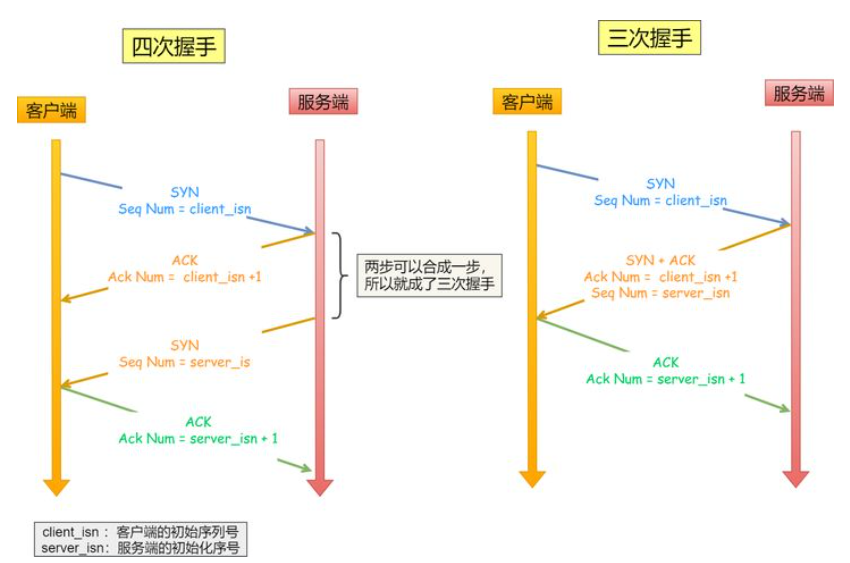
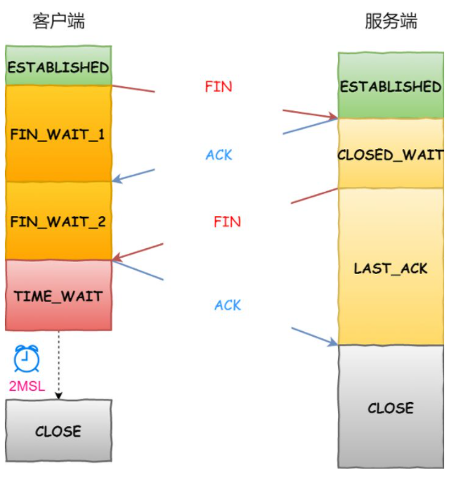

# 计算机网络——握手与挥手

## 三次握手

1. 端系统 A 发送带有Seq= A_isn  、SYN=1 的数据报给端系统 B，请求建立连接。
2. 端系统 B 收到之后，把带有 SYN=1 、ACK_Num=A_isn+1、Seq=B_isn 的数据报，发送给端系统 A。
3. 端系统 A 收到之后，发送带有 SYN=0、seq=A_isn+1、ACK_Num=B_isn+1 的数据报给端系统 B，端系统收到之后建立连接。  

（发送的 ACK num 是自己刚刚收到的SYN+1）

SYN 同步序列编号（Synchronize Sequence Numbers）：双方各有一个，开始建立连接时随机初始化，发送一次新的请求就+1。保证数据的顺序。

ISN 初始化序列编号（Initial Sequence Numbers）：

​	发送方的**字节数据编号的原点**，让对方生成一个**合法的接收窗口**。

​	动态随机，（为了避免被第三方猜到，从而被第三方伪造的RST报文reset）

### 三次握手中问题

- 第一次握手不能携带数据：三次握手还没有完成。

- 能不能让数据在第一次握手缓存下来，然后握手成功之后再接收数据？

  不能，会加大SYN Flood 攻击的风险。

- 第三次握手可以携带数据：因为能够发出第三次握手报文的主机，肯定接收到第二次握手的报文，而伪造主机是收不到第二次握手报文的。尽管服务器端状态还没有 “establish”，接收到第三次握手报文的瞬间状态就会切换为 “establish”，数据接收按正常流程走就可以。 

### TCP连接

**用于保证可靠性和流量控制维护的状态信息，这些信息包括Socket、序列号、窗口大小称为连接。**

三次握手原因：

- 可以阻止重复历史连接的初始化。

  假设有端系统 A 有一条历史请求 k ,由于网络延迟，A 已经抛弃了 k，并且A 另外发起请求 z。但过了一会儿端系统B 收到了 k（认为是第二次握手）。

  - 如果是两次握手，那么端系统B会马上基于 k 所规定的窗口，开启传输数据的服务，A 已经抛弃了 k ,而 B 去初始化 k ,就浪费了 B 的资源。
  - 如果是三次握手，那么端系统 B 不会马上传输数据，而是把把带有 SYN=1 、ACK=A_isn+1、Seq=B_isn 的数据报发送给A，要收到第三次握手报文后才开始传输。而 A 收到关于 k 的回复，是不愿意的，所以发送 RST,让 B 重新开始连接。就可以使得 B 把注意力放在下一条请求上，也就是 z 。

- 可以同步双方的初始序列号。

  

  两次握手只保证了 A 的序列号能被 B 接收，而无法保证B的序列号能被 A 接收。（A 确认了自己**收发**正常，B 只确认了自己**收**正常），所以需要三次握手。

- 避免资源浪费

  若是两次握手，那么端系统 B 在收到 SYN 报文时，就建立连接，当网络出现延迟，请求k受到延迟，端系统 A 发送新的请求，端系统B最后收到两个 SYN 包，建立两个连接，如果重复情况很多，就会造成资源大量浪费。

  三次握手中，端系统 B 收到 SYN 后不会马上建立连接，而是发送应答并且等待端系统 A 的确认应答。收到端系统 A 的确认应答再建立连接，通过双发维护一个序列号，保证连接的唯一性。

## 四次挥手



挥手需要四次，是因为服务端在发送ACK 和 FIN之间的时间里，可能有传输任务未完成，需要等待传输完成，才能关闭连接、发送FIN信号。


### 主动发起关闭连接的一方，会有 TIME_WAIT 状态。

- 防止旧连接的数据包

  假设有一个数据包 d，是第一次连接中端系统B 发到端系统A 的延迟的数据包，第一次连接已经关闭，若第二次连接与第一次有相同的TCP端口（TCP端口复用），那么数据包 d 抵达端系统 A 时，已经是第二次连接了，会发生数据错乱。

- 保证连接正确关闭

#### TIME_WAIT 长度

- TIME_WAIT过短

  第四次握手的 ACK 未送达端系统B，端系统 B 的连接未完全关闭，处于LAST_ACK 状态。当端系统 A 发起新的请求时，会被端系统 B 使用 RST 拒绝。

- TIME_WAIT刚刚好：

  端系统 B 正常收到第四次挥手 ACK 报文，则正常关闭连接。

  端系统 B 没有收到第四次挥手 ACK报文（超时），则重新发送 FIN 报文并等待新的 ACK 报文。

  **MSL （Maximum Segment Lifetime）：**最大报文段存活时间。发出去一个报文段，等待对方一个报文段到来；在2MSL内，对方没有重新发送报文段过来，则说明对方收到刚刚第一个报文段。（确认对方决定了关闭连接）

  **所以端系统 A 在 TIME_WAIT 状态等待 2MSL 时间之后就可以保证双方连接正常关闭。**

- TIME_WAIT过长
  - 内存资源占用
  - 端口资源占用：端口占满了，也就无法创建新的连接。

#### TIME_WAIT 优化

- 打开 net.ipv4.tcp_tw_reuse 和 net.ipv4.tcp_timestamps 选项；复用处于 TIME_WAIT 的 socket 为新的连接所用。
- 

### TCP 四元组

- 源地址
- 源端口
- 目的地址
- 目标端口

源地址和目的地址的字段（32位）是在 IP 头部中，作用是通过 IP 协议发送报文给对方主机。

源端口和目的端口的字段（16位）是在 TCP 头部中，作用是告诉 TCP 协议应该把报文发给哪个进程。

### TCP 保活机制

在连接空闲时，设定一个固定时间间隔发送一个探测报文，如果连续几个报文都没有得到响应，说明连接已经失效，系统内核通知上层应用。

Linux 内核可以有对应的参数可以设置保活时间、保活探测的次数、保活探测的时间间隔。

```c
net.ipv4.tcp_keepalive_time=7200
net.ipv4.tcp_keepalive_intvl=75  
net.ipv4.tcp_keepalive_probes=9
```

